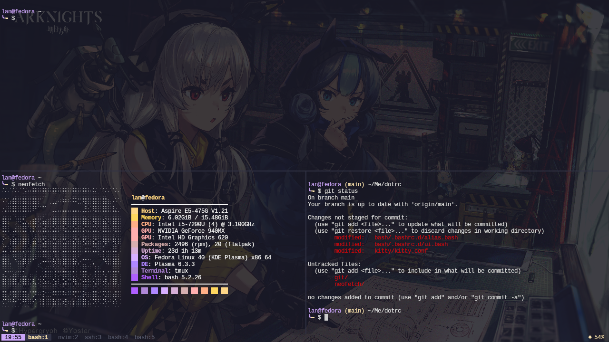

# dotrc



> Preview would regularly be updated!

## Why another config repo?

[The previous one](https://github.com/solsteace/dotfiles) was lack of documentation. It becomes a pain when I try to fiddle around with the settings. This config repo hopefully would rectify that.

> It won't happen again.

## Programs

[](./nvim/)
[](./git/)
[](./bash/)
[](./tmux/)
[](./kitty/)

## Installation

1. Acquire the source.
    ```
    git clone git@github.com:solsteace/dotrc.git
    ```

2. The easiest way to install the configurations is to create a symlink pointing to the config files here\*. An alternative way would be added on the respective directories.

    ``` bash
    ln /path/to/dotrc/program/config /path/to/actual/program/config
    ```
    
    With pwd `/path/to/dotrc`, here are the examples:
   
    ```bash
    # User's Bash
    ln -s ./bash/.bashrc ~/.bashrc
    ln -s ./bash/.bashrc.d/ ~/.bashrc.d
    
    # Neovim
    ln -s ./nvim/ ~/.config/nvim
    ```

    > \* Not sure whether it would have a side effect in the future, but for now it kinda works

## Disclaimer

I have used materials that I don't own as the assets I used on my configuration. Please refer to `/_assets/README.md` for the details.
